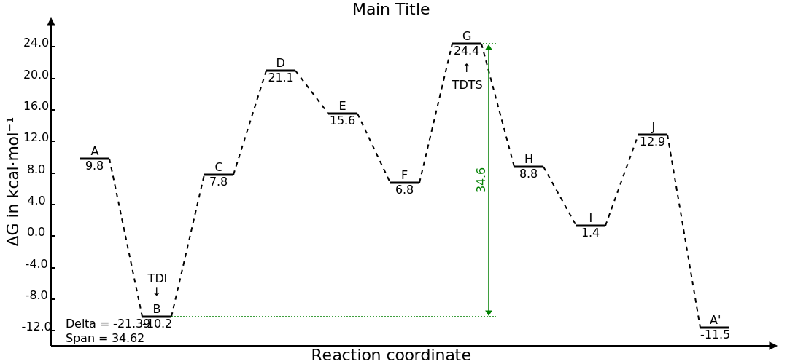
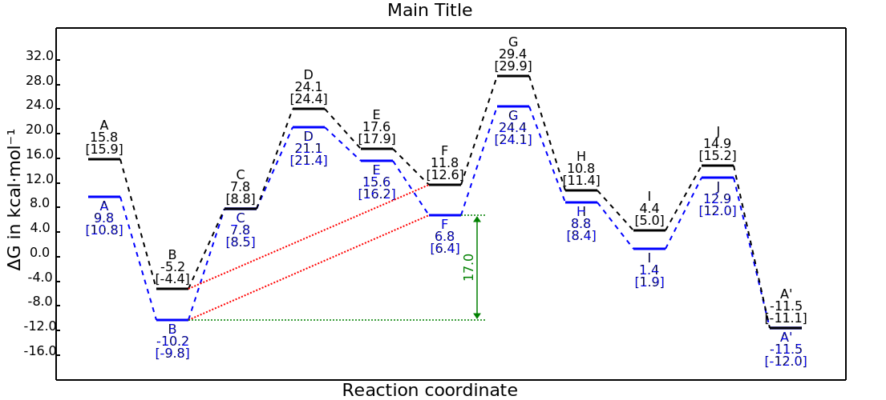
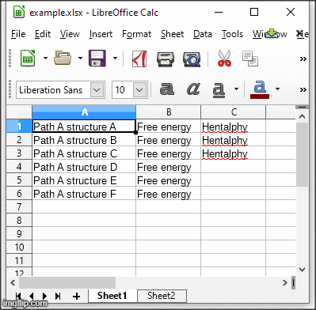

# mechaSVG

mechaSVG is a python & tk application for creating good-looking energy profile diagrams as *Scalable Vector Graphics* or **'.svg'** files with various aesthetic options. The produced graphics can also be easily edited afterwards via an svg editor like Inkscape. Extra analysis for catalytic cycle diagrams include: Finding energy span, Turn Over Frequency (TOF) estimation from both energy span and *catalytic-flux law*, and estimating degree of TOF control of both intermediates and transition states.¹\
[Watch on Youtube](https://youtu.be/0FfNRQJCJAs)\
 

## Latest updates
–Various graph styles and personalization options added.\
–Make energy comparisons betwen structures.\
–Plot up to 30 structures per 2D PES (Potential Energy Surface).\
–Slight modifications to the user interface.\
–Support for ".txt" and ".xlsx" imports and exports added. Please refer to section "**Importing .txt and .xlsx**" for information about importing these file types.

## Preview

The following pictures ilustrate the usage of the graphical user interface and the corresponding output

### Graphical interface


### Output graphs

#### Example 1



#### Example 2



#### Example 3


These svg graphs can be easily post-edited to fit your needs using freely available svg editors like [Inkscape](https://inkscape.org/).
Moreover, **Inkscape** can save them in many different image formats including **".emf"**, which in turn can be imported into some of the most popular chemical structure drawing softwares with **minimal loss in image quality**. 

## Installing & Running

The recommended installaion requires python 3.6 or above.

Fresh instalation can be done via:
```bash
python3 -m pip install setuptools mechasvg
```
Upgrading from older versions can be done via:
```bash
python3 -m pip install -U mechasvg
```
The program can be run via:
```bash
python3 -m mechasvg
```

Alternatively, a windons 10 executable can be downloaded on the following link:
[mechaSVG-v010.exe](https://github.com/ricalmang/mechaSVG/releases/download/v0.1.0/mechaSVG-v010.exe)

## Importing .txt and .xlsx

Data for mechaSVG can be inserted directly onto the user interface or be imported from xlsx and txt files.
Importing files can be done with the **Open** button on the user interface or by running the following command:
 ```bash
python3 -m mechasvg /path/to/file/example.txt
```
### .txt files

Data for .txt imports should be writen in a plain text file like in the following example:
```bash
Structure_A_Name Free_energy Entalphy
Structure_B_Name Free_energy Entalphy
Structure_C_Name Free_energy 
Structure_D_Name Free_energy 
·
·
·
```
Please notice that no spaces are allowed on structure names or energies.\
The following example ilustrates how to populate data into multiple path tabs with a single txt file.
```bash
Path_A_Structure_A Free_energy Entalphy
Path_A_Structure_B Free_energy Entalphy
Path_A_Structure_C Free_energy Entalphy
Path_A_Structure_D Free_energy
#A
Path_B_Structure_A Free_energy
Path_B_Structure_B Free_energy
#B
·
·
·

```
Please note that only the following tab flags area available:
\#A, #B, #C, #D, #E, #F, #G and #H

### .xlsx files

Data for .xlsx imports should be writen starting at the top left cell (i.e. A1 cell). Every sheet will be consecutively atributed to a reaction path tab on mechaSVG.

 |       .xlsx              |  mechaSVG |
| :-------------------------: | :-------------------------:|
|   |  |

.xlsx files can be generated using [LibreOffice Calc](https://www.libreoffice.org/) or Microsoft Excel.  


## How to cite

I don't actually require users to cite the software at all, so you can take any liberty in how or whether you cite it. However, a citation would greatly help to spread the visibility and adoption of this project which is my main goal.

If you intend to cite it, the following citation should suffice:

Angnes, R. A. mechaSVG, GitHub repository, 2020, doi: 10.5281/zenodo.4065333.

[](https://doi.org/10.5281/zenodo.4065333)

## Acknowledgments

This project was funded by São Paulo Research Foundation (FAPESP) under grant 2019/02052-4.

## References

¹Kozuch, S. & Shaik, S. *Acc. Chem. Res.* **2011**, *44*, 101. [(Paper)](https://pubs.acs.org/doi/10.1021/ar1000956)